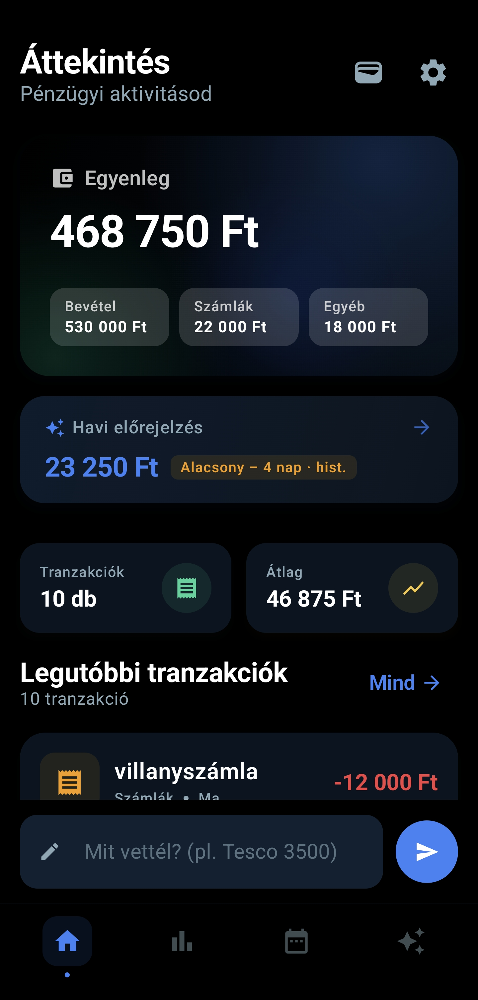
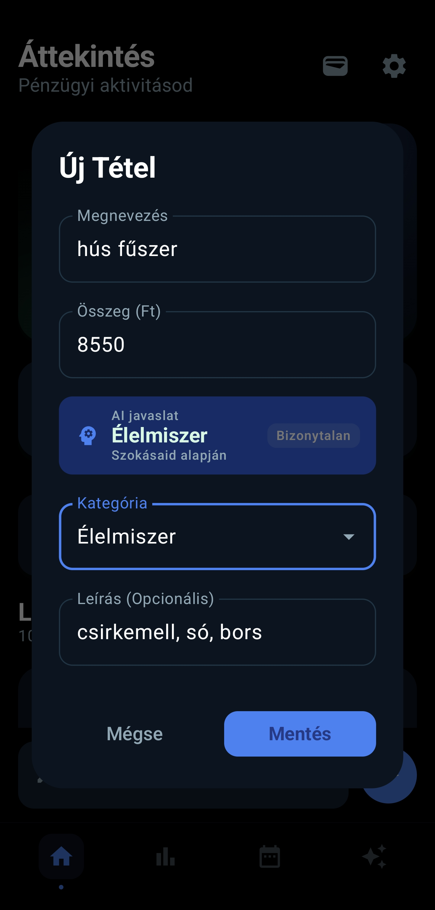
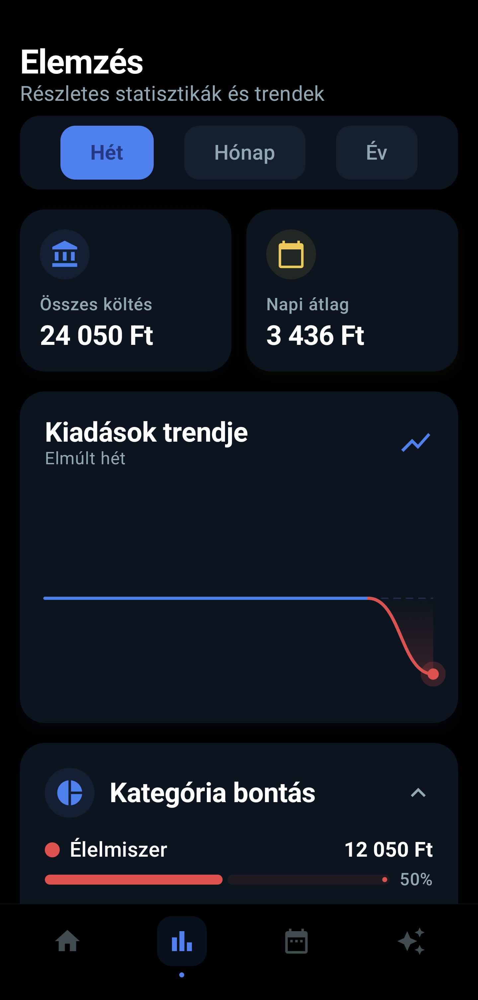
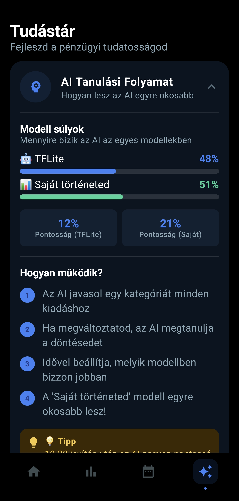
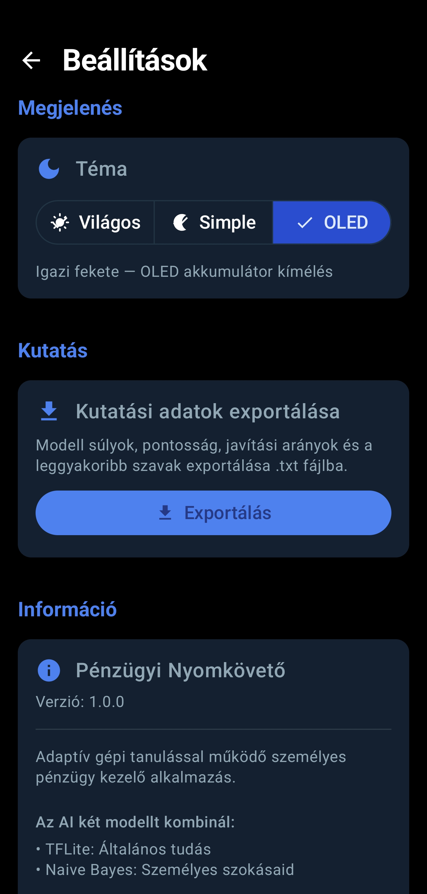

# Walt 

Személyes pénzügyi app on-device adaptív gépi tanulással


---

## Képernyőképek

| | | | | |
|:---:|:---:|:---:|:---:|:---:|
|  |  |  |  |  |
| Főoldal | Kiadás rögzítése | Elemzések | AI tanulás | Beállítások |
---

## Funkciók

- **Gyors rögzítés** — szöveges beviteli mező, automatikus összegkinyeréssel (példa bevitel: `élelmiszer bevásárlás 3500`)
- **AI kategorizálás** — on-device ensemble model, gépelés közben javasol
- **Előrejelzés a kiadásokról** — hónap végi becslés historikus adatok keverékével
- **Anomália detektálás** — szokatlanul magas heti kiadás automatikus felismerése
- **Költségvetés kezelés** — havi limitek kategóriánként, vizuális progress barral
- **Ismétlődő tételek** — automatikus havi/negyedéves/éves tranzakciók
- **3 téma** — Világos / Sötét / OLED (igazi fekete)

---

## ML rendszer

Két modell fut párhuzamosan, adaptív súlyokkal:

| Modell | Típus | Tanulás |
| --- | --- | --- |
| TFLite | Neurális háló (előre betanított) | Statikus |
| Naive Bayes | Saját implementáció | On-device, valós idejű |

A súlyok EMA alapján igazodnak a felhasználó döntéseihez (α=0.1, határok: 15%–85%). A kiadás-előrejelzés az elmúlt 3 hónap + tavalyi azonos hónap adatait keveri a jelenlegi hónap mediánszűrt napi átlagával.

---

## Tech stack

`Jetpack Compose` · `Material3` · `Room v5` · `TensorFlow Lite` · `WorkManager` · `DataStore` · `Vico` · `Navigation Compose` · `MVVM`

---

## Futtatás

```bash
git clone https://github.com/PtrMrc/personal-finance-app.git
```

Android Studióban: **File → Open**, Gradle sync, majd **Run ▶**

> A `expense_classifier.tflite` és `vocab.json` assets be vannak csomagolva — nincs külön letöltés.

---

## Tesztek

```bash
./gradlew test
```

Pure JVM unit tesztek, Android context nélkül — fake DAO-kkal és interfész-alapú mockokkal.

---

*Debreceni Egyetem · 2026*